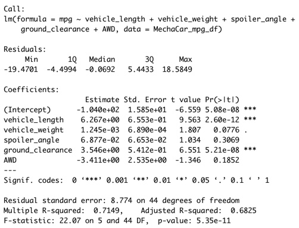
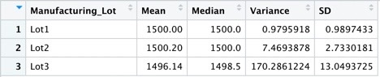
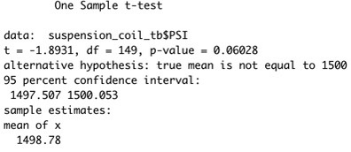
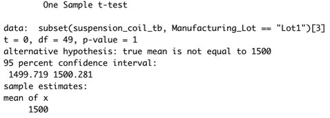
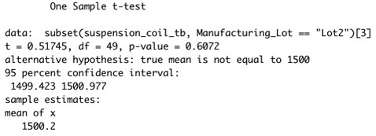
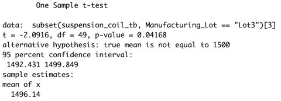

# MechaCar_Statistical_Analysis

*Prepared for Jeremy*

## Linear Regression to Predict MPG

The following statements reflect the summary statistics shown below:

* Due to the **vehicle length** and **ground clearance** variables havin p-values of less than 0.05, it is likely that they provided a non-random amount of variance to the mpg values in the dataset, and therefore they are significant and considered to have contributed to miles per gallon (MPG)
* The slope of the linear model is **not** 0 and therefore the null hypothesis is rejected (this is primarily due to the fact that several independent variables have coefficients (slope) larger than 0, ie. **vehicle length** had a coefficient of 6.23 and ground clearance has a coefficient of 3.55)
* This model is a **very good** predictor of MPG as a whole due to the p-value being **5.35e-11**

## Summary Statistics on Suspension Coils

The design specifications for the MechaCar suspension coils dictate that the variance of the suspension coils must not exceed 100 pounds per square inch. As shown in the data below, the current manufacturing data meets this design specification for all manufacturing lots in total (with a variance of **62.3**):

When viewing the results per lot (individually), it is clear that lot 1 and lot 2 pass, however lot 3 has a variance of **170.3** and therefore indiciates failure for meeting this design specification:

## T-Tests on Suspension Coils

From the data shown above from the t-test, it is clear that there is no statistically significant difference between the mean PSI of the overall manufacturing process mean PSI and the population's mean PSI as the p-value is *greater* than 0.05, and therefore the null hypothesis **cannot** be rejected (fail to reject the null).

The p-value for **lot 1** and **lot 2** are both above 0.05, and therefore we fail to reject the null hypothesis. However, since the p-value of our t-test for **lot 3** is less than 0.05, we can conclude that there is a statistically significant difference between the overall manufacturing process mean PSI and the mean PSI of lot 3.

## Study Design: MechaCar vs Competition

Additional statistical studies can be used to quantify how the MechaCar performs against the competition. One item that could be looked at is safety rating as shown in the outline below:
* Metrics tested for safety rating include number of airbags and number of driver-assist safety features (ie. front collision warning, rear collision warning, etc)
* **Null Hypothesis:** The increased number of airbags and driver-assist safety features **does not** provide a higher rating on the NHTSA (New Car Assessment Program)
* **Alternative Hypothesis:** The increased number of airbags and driver-assist safety features provides a higher rating on the NHTSA (New Car Assessment Program)
* Multiple linear regression would be the best statistical test to effectively determine the above (this is primarily due to the mutliple independent variables ie. number of airbag, number of driver-assist sasfety features, etc.)
* The data needed to run the statistical test includes numebr of airbags and driver-assist safety features of MechaCars and competitors, as well as the NHTSA (New Car Assessment Program) star ratings for each vehicle
